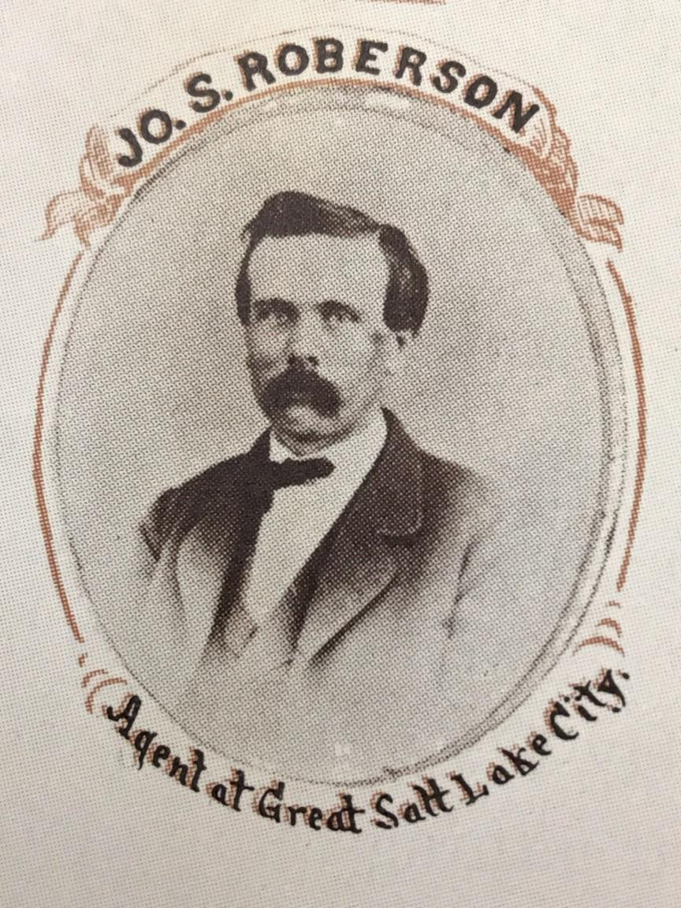

Welcome to The Roberson Letters!  

My name is Mark Saenger and the handsome man to the left is my great-great grandfather Joseph S. Roberson.  Mr. Roberson led a very interesting life and forunately for us he kept copies of a great deal of correspondence between himself and friends, family, and most importantly a one Miss Emily Lofland.  

In 1877 Mr. Roberson was traveling west and wished to keep in contact with his love, Emily Lofland. My family has copies of his letters he wrote between 1877 and 1878 with most of them being to Miss Lofland.  I don't want to spoil anything, so please join me in reliving the American West!
